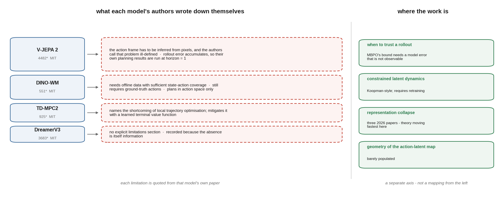
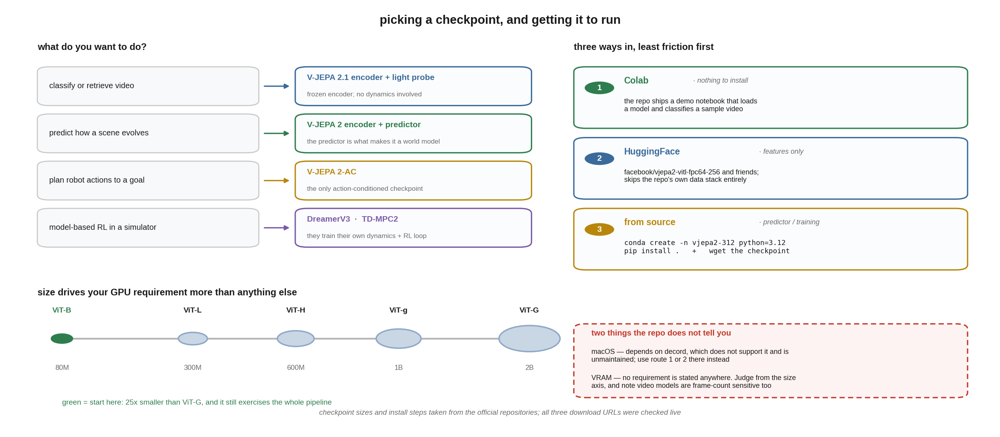
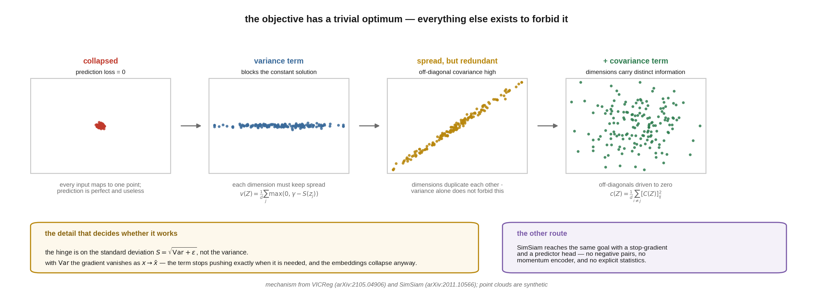

# world-model-map

**A researcher's map of open-source world models — what exists, what each line of work actually claims, and where its authors say it breaks.**

<p align="center">
  
</p>

<sub>The figure above is generated by <a href="docs/map_figure.py">docs/map_figure.py</a> — <code>pip install sciglyph</code> and run it to reproduce <code>docs/map.png</code> byte for byte.</sub>


There are plenty of awesome-lists for world models. This is not one. A link and a one-line abstract tell you a paper exists; they do not tell you whether the method works on your problem, or what its authors already know is wrong with it.

So this map records something different: **the limitations the authors wrote down themselves**. That information is real, load-bearing, and almost impossible to find — it sits in section 4.3, or an appendix, or a single sentence in the discussion.

---

## Evidence levels

Everything here is marked with how far it was actually read. Nothing is summarised from a title.

| mark | meaning |
|---|---|
| 📖 | full text read, including the limitations section |
| 📄 | abstract and metadata only — treat claims as unverified |

Every citation was checked against OpenAlex/Crossref/arXiv with [`scholarcheck`](https://github.com/GuoCheng24/scholarcheck), so the DOIs resolve and the papers exist.

---

## The open models

Repository state as of 2026-08-19. **Last push matters**: three of the best-known repositories have not been touched in over a year.

| repo | ★ | license | last push | what it is |
|---|---|---|---|---|
| [NVIDIA/cosmos](https://github.com/NVIDIA/cosmos) | 11551 | see repo | 2026-08-18 | action-conditioned video generation as a world model |
| [facebookresearch/vjepa2](https://github.com/facebookresearch/vjepa2) | 4482 | **MIT** | 2026-03-23 | V-JEPA 2 / V-JEPA 2-AC — latent video prediction + action-conditioned planning |
| [facebookresearch/jepa](https://github.com/facebookresearch/jepa) | 4094 | see repo | 2025-02-27 | V-JEPA 1 — *no longer updated* |
| [danijar/dreamerv3](https://github.com/danijar/dreamerv3) | 3683 | **MIT** | 2026-05-25 | recurrent latent world model, one hyperparameter set across domains |
| [facebookresearch/ijepa](https://github.com/facebookresearch/ijepa) | 3487 | see repo | 2024-05-08 | I-JEPA — image JEPA, *no longer updated* |
| [eloialonso/diamond](https://github.com/eloialonso/diamond) | 2091 | **MIT** | 2024-12-06 | diffusion world model, *no longer updated* |
| [nicklashansen/tdmpc2](https://github.com/nicklashansen/tdmpc2) | 925 | **MIT** | 2026-07-13 | implicit world model + local trajectory optimisation |
| [gaoyuezhou/dino_wm](https://github.com/gaoyuezhou/dino_wm) | 551 | **MIT** | 2025-03-24 | world model on frozen DINO features, zero-shot planning |


---

## Getting one running

The models below are downloadable and the licences are permissive, but the
repositories assume you already know which checkpoint you want. This section is
the part that is usually missing.

<p align="center">
  
</p>

### Which one do you actually need

| if you want to… | use | why |
|---|---|---|
| classify or retrieve video, or use video features downstream | **V-JEPA 2 / 2.1 encoder** | a frozen encoder plus a light probe; no dynamics model involved |
| predict how a scene evolves in representation space | **V-JEPA 2 predictor** | the predictor is what makes it a world model rather than an encoder |
| plan robot actions from a goal image | **V-JEPA 2-AC** | the only action-conditioned checkpoint; trained from the ViT-g encoder |
| do model-based RL in a simulator | **DreamerV3** or **TD-MPC2** | they train their own latent dynamics and come with RL loops |
| plan from frozen visual features with no video pre-training | **DINO-WM** | builds the world model on frozen DINO features |

### Checkpoints, with sizes

Straight from the V-JEPA 2 repository. Size drives your GPU requirement more
than anything else.

| release | model | params | resolution |
|---|---|---|---|
| V-JEPA 2 | ViT-L/16 | 300M | 256 |
| V-JEPA 2 | ViT-H/16 | 600M | 256 |
| V-JEPA 2 | ViT-g/16 | 1B | 256 |
| V-JEPA 2 | ViT-g/16<sub>384</sub> | 1B | 384 |
| **V-JEPA 2.1** | ViT-B/16 | **80M** | 384 |
| V-JEPA 2.1 | ViT-L/16 | 300M | 384 |
| V-JEPA 2.1 | ViT-g/16 | 1B | 384 |
| V-JEPA 2.1 | ViT-G/16 | **2B** | 384 |
| V-JEPA 2-AC | ViT-g/16 | 1B | 256 (8 frames) |

**Start with V-JEPA 2.1 ViT-B/16 (80M).** It is the smallest thing that
exercises the whole pipeline, and it is over an order of magnitude smaller than
ViT-G. Scale up once your loop works.

### Three ways in, easiest first

**1 · Colab, no local setup.** The repository ships a
[demo notebook](https://colab.research.google.com/github/facebookresearch/vjepa2/blob/main/notebooks/vjepa2_demo.ipynb)
that loads a model and classifies a sample video. Nothing to install.

**2 · HuggingFace, if you only need features.** Weights are mirrored as
`facebook/vjepa2-vitl-fpc64-256`, `-vith-`, `-vitg-`, `-vitg-fpc64-384`. Loading
through `transformers` skips the repository's own data stack entirely.

**3 · From source, if you want the predictor or to train.**

```bash
conda create -n vjepa2-312 python=3.12
conda activate vjepa2-312
pip install .            # or -e . for development

wget https://dl.fbaipublicfiles.com/vjepa2/vitg-384.pt -P ckpt/
wget https://dl.fbaipublicfiles.com/vjepa2/evals/ssv2-vitg-384-64x2x3.pt -P ckpt/
python -m notebooks.vjepa2_demo    # after updating the paths in the script
```

⚠️ **macOS**: the pipeline depends on `decord`, which does not support macOS and
is no longer maintained. The maintainers point at community forks rather than
recommending one. On macOS, prefer route 1 or 2.

⚠️ **The repository does not state VRAM requirements.** Judge from parameter
count, and note that video models are also frame-count sensitive — the AC config
is 8 frames at 256px. Test on the smallest checkpoint before committing.

### What "action-conditioned" changes

V-JEPA 2-AC is the only one of these you can hand an action to. It was
post-trained from the ViT-g encoder on robot data
(`configs/train/vitg16/droid-256px-8f.yaml`), and it is what makes goal-directed
planning possible: the planner proposes action sequences, the model predicts
where each one lands in representation space, and the sequence whose predicted
state is closest to the goal wins. That loop is where the limitations in the
next section start to bite.

---

## What the authors say breaks

This is the part you cannot get from an abstract.

### V-JEPA 2 📖 — [arXiv:2506.09985](https://arxiv.org/abs/2506.09985)

Two limitations, stated in §4.3:

**Camera position is load-bearing, and the problem is ill-posed.** V-JEPA 2-AC predicts the next frame's representation given an end-effector Cartesian action, *without camera calibration*. It therefore has to infer the action coordinate axis from monocular RGB — but the robot base is often outside the frame, so, in the authors' words, "the problem of inferring the action coordinate axis is not well defined, leading to errors in the world model." They report having **manually tried several camera positions** before settling on one that worked. A quantitative sensitivity analysis is in their Appendix B.4.

**Long-horizon planning is not solved, and the paper's own numbers show it.** Autoregressive rollout accumulates error — prediction accuracy falls as the rollout lengthens — and the action search space grows exponentially with horizon. Their planning results (Table 3) are run at **horizon = 1**. The efficiency win over a diffusion-based video world model is nonetheless large: 16 seconds per action versus 4 minutes.

### DINO-WM 📖 — [arXiv:2411.04983](https://arxiv.org/abs/2411.04983)

Three, stated together:

- needs **offline data with sufficient state-action coverage**, hard to obtain in complex environments;
- still requires **ground-truth actions**, which internet-scale video does not have;
- plans **in action space only** — no hierarchy between high-level planning and low-level control.

### TD-MPC2 📖 — [arXiv:2310.16828](https://arxiv.org/abs/2310.16828)

Names the shortcoming of **local** trajectory optimisation explicitly, and mitigates it by bootstrapping returns beyond the planning horizon with a learned terminal value function — a partial fix, not a solution.

### DreamerV3 📖 — [arXiv:2301.04104](https://arxiv.org/abs/2301.04104)

**No explicit limitations section.** Recorded here because its absence is itself information: the robustness claim is "one hyperparameter set across domains", and the paper does not enumerate where that breaks.

---

## How the failure modes are actually attacked

The mechanism matters more than the paper list: it decides whether you can adopt
something without retraining, and what you would have to prove to improve on it.

### Collapse — and why it is a *design* problem, not a bug

A JEPA-style objective predicts one embedding from another. That objective has a
trivial optimum: **map everything to the same vector**, and the prediction is
perfect. Everything else in the design exists to make that solution unreachable.

<p align="center">
  
</p>

Two published families do this, and they are worth contrasting because they
disagree about how much machinery is needed:

**Stop-gradient alone.** SimSiam 📖 ([arXiv:2011.10566](https://arxiv.org/abs/2011.10566))
shows a Siamese network avoids collapse with a stop-gradient and a predictor
head, with **no negative pairs and no momentum encoder**. Structurally minimal;
the reason it works is still argued over.

**Explicit statistical constraints.** VICReg 📖 ([arXiv:2105.04906](https://arxiv.org/abs/2105.04906),
ICLR 2022) writes three terms on the embeddings `Z = [z₁ … zₙ]` (`d` dimensions,
batch `n`):

| term | definition | what it forbids |
|---|---|---|
| variance | `v(Z) = (1/d) Σⱼ max(0, γ − S(zⱼ, ε))`, `S(x,ε) = √(Var(x)+ε)`, `γ = 1` | every dimension must keep spread — blocks the constant solution |
| covariance | `c(Z) = (1/d) Σ_{i≠j} [C(Z)]²ᵢⱼ` | off-diagonal correlations → 0, so dimensions cannot duplicate each other |
| invariance | `s(Z,Z′) = (1/n) Σᵢ ‖zᵢ − z′ᵢ‖²` | the actual predictive objective |

with `ℓ = λs + μ[v(Z)+v(Z′)] + ν[c(Z)+c(Z′)]`.

**The detail worth carrying away** is in the variance term. The paper is explicit
that using the *standard deviation* rather than the variance inside the hinge is
**crucial**: with `S(x) = Var(x)`, the gradient of `S` vanishes as `x` approaches
its mean, so the gradient of `v` vanishes too — and the embeddings collapse
anyway. A hinge on the variance would look like the same regulariser and fail.

That is the shape of a real mathematical improvement in this area: not a new
architecture, but noticing that a term everyone would write one way has a
degenerate gradient.

### Rollout error — bounded in theory, unbounded in practice

Autoregressive prediction compounds: feed a prediction back in, and its error
becomes part of the next input. Every model above suffers from it, which is why
V-JEPA 2's own planning runs at horizon 1.

**MBPO** 📖 ([arXiv:1906.08253](https://arxiv.org/abs/1906.08253)) gives the
reference bound. With `ε_m` bounding the expected TV-distance between true and
model transitions and `ε_π` bounding policy divergence,

```
η[π]  ≥  η̂[π] − C(ε_m, ε_π)
```

so improving returns under the model by more than `C` guarantees improvement on
the real system. The structure is right and the catch is structural too:
**`ε_m` is not observable.** You have to estimate the very quantity that the
guarantee is about, and the bound is only as good as that estimate.

**Acting upon Imagination** 📖 ([arXiv:2105.05716](https://arxiv.org/abs/2105.05716))
takes the practical route: **ensemble variance** as a trust signal for when to
re-plan. It works, and it is a heuristic — the spread of an ensemble is not a
coverage guarantee, and nothing forces it to be calibrated.

**What is open here.** Neither gives a *distribution-free, finite-sample*
statement about a specific rollout at a specific horizon. Conformal prediction is
the obvious tool, and the obstacle is equally obvious: split conformal needs
exchangeability, and **successive rollout steps are not exchangeable** — step
`k+1` is computed from step `k`'s output. Adapting it is a real problem, not
a matter of applying the standard recipe.

### Constraining the dynamics itself

Rather than measuring the error, restrict the transition map so it cannot blow
up. **Koopman Dreamer** 📄 (2026) puts spectral constraints on a deterministic
latent dynamics core; **SD-GWM** 📄 (2026) constrains rollout on a graph and
positions itself as a *verifiable substrate* rather than a better forecaster.

Both **require retraining** — you are changing the model, not wrapping it. That
is the practical cost line running through this whole section.

### Where the action frame lives — the thinnest area

V-JEPA 2-AC takes an end-effector Cartesian action and predicts the next
representation, **without camera calibration**. So the model must infer the
action coordinate frame from monocular pixels — and when the robot base is out
of frame, the authors state the inference problem **is not well defined**.

This is a geometry question before it is a learning question: *under what
conditions on the observation is the action frame identifiable at all?* If it is
not identifiable, no amount of training data fixes it, and the authors' own
workaround — trying camera positions by hand until one works — is exactly what
you would expect.

Almost nothing addresses this directly, which is why it is listed here at all.

## Reference list by line of work

Grouped by *what they change*, which is what decides whether you can adopt one without retraining.

### 1. When can a rollout be trusted?

The oldest and most-cited line, and still open.

- **MBPO** 📖 — [arXiv:1906.08253](https://arxiv.org/abs/1906.08253). Theorem 4.1 bounds true returns by model returns minus `C(ε_m, ε_π)`, where `ε_m` bounds the TV-distance between true and model transitions. The structure is sound; the catch is that **`ε_m` is not observable** and has to be estimated before the bound can be used.
- **Acting upon Imagination** 📖 — [arXiv:2105.05716](https://arxiv.org/abs/2105.05716). Uses **ensemble variance** to decide when to re-plan. Heuristic; no coverage guarantee.
- **Metric Non-Collapse in Learned World Models for Control** 📄 (2026) — advertises approximation theory and *finite-sample geometric guarantees*. Not yet read in full.

*Open:* none of the above gives a **distribution-free, finite-sample** statement about a specific rollout at a specific horizon. Conformal methods are the obvious candidate; the non-trivial part is that rollout steps are **not exchangeable**, so textbook split conformal does not apply unmodified.

### 2. Constraining the latent dynamics

- **Koopman Dreamer** 📄 (2026, arXiv:2607.19719) — spectrally constrained deterministic latent dynamics, aimed at stable imagination.
- **SD-GWM** 📄 (2026, arXiv:2608.0868) — structural dynamics graph world model with constrained rollout and calibration; explicitly positioned as a *verifiable substrate* rather than a better forecaster.

*Requires retraining.* Adopting either means changing the training objective, not adding a module.

### 3. Representation collapse

The failure mode JEPA-style objectives are built to avoid, and where the theory is currently moving fastest.

- **A Minimal Model of Representation Collapse: Frustration, Stop-Gradient, and Dynamics** 📄 (2026)
- **Rectified LpJEPA: sparse and maximum-entropy representations** 📄 (2026)
- **Gaussian Joint Embeddings for SSL** 📄 (2026)
- **SimSiam** 📖 — [arXiv:2011.10566](https://arxiv.org/abs/2011.10566), the reference point for why stop-gradient alone prevents collapse.

### 4. Geometry of the action–latent map

Barely populated, and the V-JEPA 2 camera limitation lands squarely in it. If a model must infer the action coordinate frame from pixels, then **identifiability of that frame** is a precondition for the world model being correct at all — and the authors report it is not always well defined.

*Open:* what conditions on the observation make the action frame identifiable, and can the map be estimated at test time rather than assumed.

---

## What this map deliberately does not do

It does not rank methods, and it does not claim any of these directions will work. Several of the entries above are marked 📄 precisely because the honest thing to say is "the abstract claims this and I have not verified it."

If you are looking for a starting point: **the limitations sections are where the open problems already are**, written down by the people who know the method best. That is the whole idea behind this file.

## Contributing

Corrections are welcome, especially:

- a limitation stated by authors that is missing here;
- an entry marked 📄 that you have read in full — send the section number;
- a repository whose status has changed.

Please cite the section or page. **Claims sourced from an abstract will be marked 📄**, whoever submits them.

## License

CC BY 4.0 — reuse with attribution.
